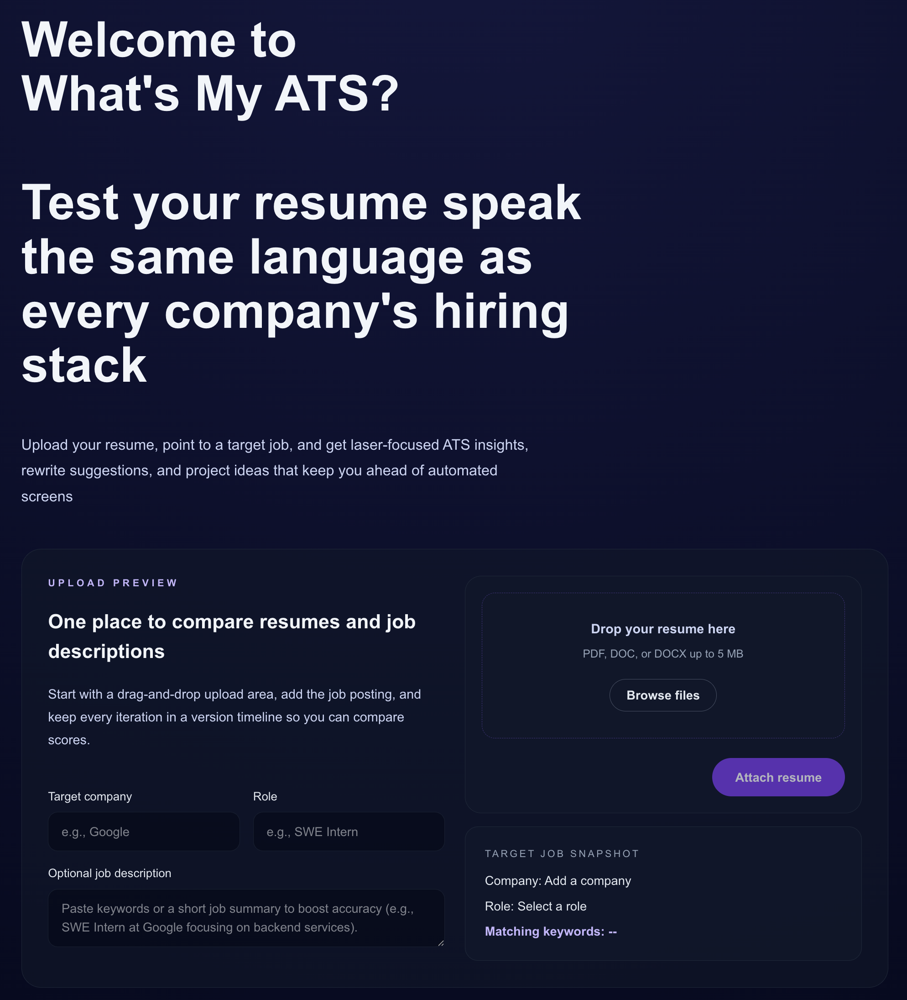
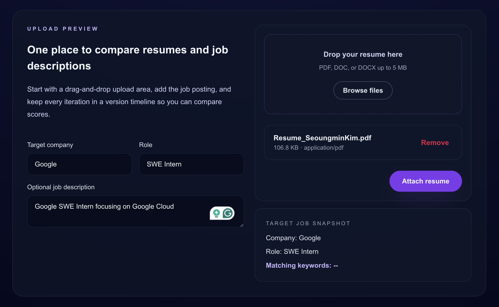
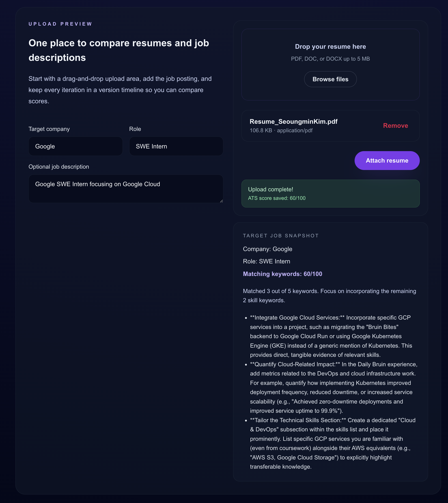

## What's My ATS?

Personal playground for building an AI-assisted resume scoring assistant that tailors feedback to each target company.

### How To Use?

1. Upload your resume and select a target company and role (required) and paste a job description (optional)
   
2. Hit the "Attach Resume" button
   
3. You will get a mock ATS score based on your resume and get feedback generated by Google Gemini API
   

### Tech Stack

- Client Side (public)
  - Next.js 16 App Router with TypeScript and React Server Components
  - Tailwind CSS with the new `@tailwindcss/postcss` plugin pipeline
  - Geist font pairings via `next/font`
- Server Side (private)
  - FastAPI + spaCy + sentence-transformers, queued behind Redis/BullMQ, Google Gemini API (current version with Gemini 2.5 PRO)

### Getting Started

```bash
npm install
npm run dev
```

The app runs on <http://localhost:3000>

### Project Direction

1. Wire a scoring API based on Gemini 2.5 Pro so the upload card can return example scores.
2. Build a dedicated workspace view with resume history and JD comparison.
3. Extract shared UI into `src/components` and compose with shadcn/ui primitives.

### Learning Notes

- Endpoint POST Method `${API_BASE_URL}/analysis/upload` will call the server to evaluate the resume based on keywords and generate the feedback
- The home page shows how to combine data-driven Tailwind components with React Server Components.
- Metadata lives in `src/app/layout.tsx`; update it once you add new routes.
- Tailwind classes are available globally because `@import "tailwindcss";` is declared in `globals.css`.
- Styling is consolidated in `src/styles/Home.module.css` to keep the JSX free from long utility strings.
- Connecting PostgreSQL to store the resume in the database
